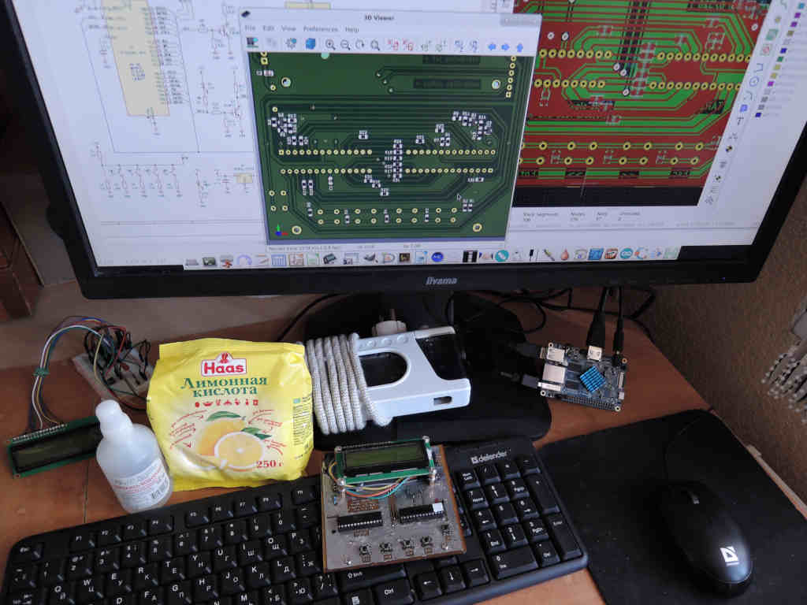

# avr_hvpp

Simple hvpp programmer on atmega8 and 1602A lcd with twi extention 

Kicad schematics and pcb's are placed in hardware folder.
Sure you can even plug mega328 into master socket and 
write your code in arduino ide and modify pcb for another package. 
Kicad is the most useful tool to change things you like 

I'm thinking about coding main menu in C and others:  
lcd, twi, adc and hvpp libraries in assembly. 
Pure C version I coded was compiled to 8k (w/o a few bytes) 
Assembly version is changing now. If you need test one working 
You can find a hex file named chiphealer.hex on hardware folder. 
Some more errors has to be fixed and I may commit its gas version too 

All work except kicad were processed on orange pc. 
It's very hard to edit pcb and schematics on orange 
(opengl works and 3d model turns but don't do that, 
really, beleve me)

And more. I'm learning now. Doing a lot of compromised 
steps in programming. These are like a practical answers 
to some questions and thus not perfect 

